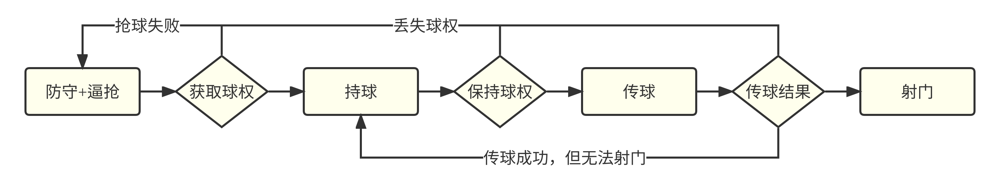

# 

## 2023『途零』🤖⚽竞赛交流会

### 中国地质大学（北京）

###### Created by [Mark](https://github.com/Mark-ZU)
---
<!-- _class: lead -->
# 机器人🤖足球⚽竞赛交流会

##### 承办竞赛的反馈与总结
##### 参赛经验分享与新手入门
##### 通过沟通平台和交流社群，促进比赛良好发展
---
# 主要内容

* **上半场**
    * 竞赛经验分享
    * 专题研讨分享
* **下半场**
    * 沟通答疑与反馈
    * 实训演练

---
# 竞赛经验分享
* 2023年比赛反思
* 预测后续的主要进步方向
    * 关于策略：实现**容易维护和传承**的传球策略
    * 单体技能：Skill向通用/鲁棒/泛化的方向实现
    * 硬件改进：针对原有机器人硬件的改进与创新
* 后续比赛改进方向
    * 持续自动化（机器人更换）
    * 提升观赏性（取消出界）

---
# 决策状态机

* 稳定的Skill - 传球，接球（Intercept/Chase/Touch/Rush）
* 决策模块 - <Receiver,Pos,KickMode,Power>
* 执行稳定 - 传球精度，运动精度

---
###### 策略框架

---
# 球模型

---
# 运动参数调节
* 视觉系统的延时/噪声
* 运动速度与加速度 - 移动/旋转
* 运动的预测补偿 - 移动/旋转
* 关于DSS参数
    * 预测时间
    * 避障距离

---
# lua与c++
* c++ - lua
    * LuaModule - RunScript(name)
* lua - c++
    * raw c function : LuaModule - DefMap
    * class/self pointer : tolua++ - pkg
* compare
    * lua : 弱类型，封装
    * c++ : 高性能计算

---
## 相关开发计划

---
<!-- backgroundImage: -->
<!-- _class: lead invert -->
# Q&A
* 关于挑球射门的规则
* 稳定的传球