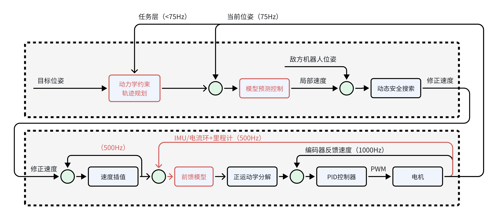

# 

## 2023『途零』🤖⚽竞赛交流会

### 武汉大学

###### Created by [Mark](https://github.com/Mark-ZU)
---
<!-- _class: lead -->
# 机器人🤖足球⚽竞赛交流会

##### 承办竞赛的反馈与总结
##### 参赛经验分享与新手入门
##### 通过沟通平台和交流社群，促进比赛良好发展

---
# 主要内容

* **上半场**
    * 竞赛经验分享
    * 专题研讨分享
* **下半场**
    * 沟通答疑与反馈
    * 实训演练

---
# 竞赛经验分享
* 2023年比赛反思
* 预测后续的主要进步方向
    * 关于策略：实现**容易维护和传承**的传球策略
    * 单体技能：Skill向通用/鲁棒/泛化的方向实现
    * 硬件改进：针对原有机器人硬件的改进与创新
* 后续比赛改进方向
    * 持续自动化（机器人更换）
    * 提升观赏性（取消出界）

---
### 比赛系统介绍

---
# 决策状态机

* 稳定的Skill - 传球，接球（Intercept/Chase/Touch/Rush）
* 决策模块 - <Receiver,Pos,KickMode,Power>
* 执行稳定 - 传球精度，运动精度

---
###### 策略框架

---
# 球模型

---
# 敌方威胁度序列（v2014-v2017）
> Rule-based Weighted Evaluation
* 位置信息
    * 距离球门/射门角度
* 速度信息
    * 当前速度/历史加速度
* 意图判定
    * 是否适合Touch/Intercept/Chase等方式进攻

---
# 敌方威胁度序列（截球点预测算法后）
> 在足球中，任何多打少的局部对抗都应该转化成进球
* （球在己方禁区附近）基于截球时间判断进行排序
* （球远离己方禁区）盯防**所有**在**射门威胁区域**内的敌方
    * 基于运动模型计算守门员的响应区域
    * 对区域进行扩充
    * 使用marking进行一对一盯防

---
## Skill举例 - 盯防 - 新旧算法对比

---
## 准备比赛 - 了解机器人性能
* 运动性能
    * 最大速度，最大加速度，开环误差
* 持球性能
    * 持球状态下 - 移动速度/移动加速度
* 踢球性能
    * 最大挑球距离，最大平射速度
* 通信稳定性
    * 通信带宽/距离/抗干扰能力

---
## 准备比赛 - 机器人标定
> 总则 ： 相同的参数/指令 → 相同的效果
* 针对机器人差异
    * 运动补偿
    * 踢球标定
    * *电机的PID曲线*

---
## 准备比赛 - 机器人运动参数调节
* 视觉系统的延时/噪声
* 运动速度与加速度 - 移动/旋转
* 运动的预测补偿 - 移动/旋转
* 关于DSS参数
    * 预测时间
    * 避障距离

---
## 准备比赛 - 针对新场地
* 针对球
    * 滚动摩擦力 / 弹跳的衰减系数
* 机器人
    * 视觉延时参数/加速度/速度/加速度ratio（GoCmuRush）
* 综合测试
    * getBall()
    * 标定分档（踢球力度）
    * 综合传球

---
<!-- backgroundImage: -->
<!-- _class: lead invert -->
# Q&A
* 视觉
    * 视野盲区/贴墙/调试精度要求？/边缘准确性减弱？
* 犯规
    * 开球DoubleTouch/边线的放球
    * 拿球速度过快/来不及减速/碰撞
* 其他
    * 裁判软件/硬件学习/比赛时的硬件抖动？

---
<!-- backgroundImage: url('https://marp.app/assets/hero-background.svg')-->
### 小型足球机器人的运动规划

---
### 小型足球机器人的运动规划 - 改进

---
### 开发进度
