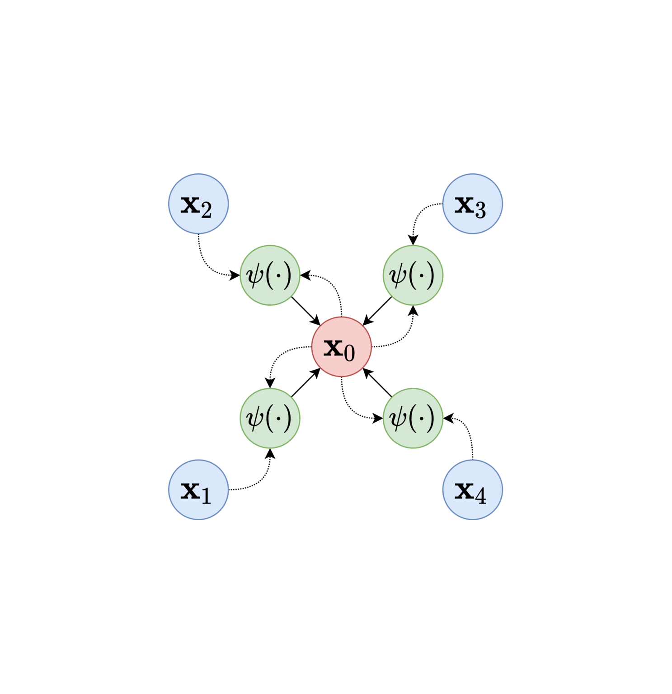

# 

## 2023『途零』🤖⚽竞赛交流会

### 宁波大学

###### Created by [Mark](https://github.com/Mark-ZU)
---
<!-- _class: lead -->
# 机器人🤖足球⚽竞赛交流会

##### 为竞赛参与者提供一个沟通平台和交流社群，促进比赛良好发展
---
# 主要内容

* **上半场**
    * 竞赛经验分享
    * 专题研讨分享
* **下半场**
    * 沟通答疑与反馈
    * 实训演练

---
# 竞赛经验分享
* 2023年比赛反思
* 预测后续的主要进步方向
    * 关于策略：实现**容易维护和传承**的传球策略
    * 单体技能：Skill向通用/鲁棒/泛化的方向实现
    * 硬件改进：针对原有机器人硬件的改进与创新
    * *运动规划*：如何实现更高效鲁棒的规划算法
* 2024年技术挑战赛规则（**草案**）
---

# 技术挑战赛
### 定点传球赛
* 考验Skill的执行效率
* 对于敌方机器人的行为预测
* 考验对于传球决策的计算

---
###### 策略框架


---
# 球模型


---
### 场地参数
* 针对球
    * 滚动摩擦力 / 弹跳的衰减系数
* 机器人
    * 视觉延时参数/加速度/速度/加速度ratio（GoCmuRush）
* 综合测试
    * getBall()
    * 标定分档（踢球力度）
    * 综合传球

---
# 敌方威胁度序列（v2014-v2017）
> Rule-based Weighted Evaluation
* 位置信息
    * 距离球门/射门角度
* 速度信息
    * 当前速度/历史加速度
* 意图判定
    * 是否适合Touch/Intercept/Chase等方式进攻
---
# 敌方威胁度序列（截球点预测算法后）
> 在足球中，任何多打少的局部对抗都应该转化成进球
* （球在己方禁区附近）基于截球时间判断进行排序
* （球远离己方禁区）盯防**所有**在**射门威胁区域**内的敌方
    * 基于运动模型计算守门员的响应区域
    * 对区域进行扩充
    * 使用marking进行一对一盯防
---
## Skill举例 - 盯防 - 新旧算法对比


---
## Goalie（v2019）
<style scoped>
pre {
   font-size: 1.5rem;
}
</style>
```bash
└── GoalieTask
    ├── ClearBall    # 球在禁区内需要清除
    │   ├── MakeItSafe # 球恰好在边界，防止踢到其他机器人
    │   └── PassBall   # 传球给己方球员
    ├── Intercept    # 安全零速接球
    ├── NonZeroInter # 非零速扑救
    ├── RushToFace   # 禁区附近有敌方机器人等待接球时
    └── Stand        # 普通椭圆形站位
```

---

# 关于ML/RL/模型
* 探索性&实际应用的平衡
* 寻找切实可行的落地场景
* 鲁棒的机器人执行/Skill层的重要性
* 探索性的课题
    * 场景中使用GNN
    * 从在线的参数优化或模式识别的角度入手
    * 在传统方法基础上利用学习进行**补偿**
---
# 相关论文
- Du, Haozhe, et al. "Multi-Agent Trajectory Prediction Based on Graph Neural Network." 2021 IEEE International Conference on Real-time Computing and Robotics (RCAR). IEEE, 2021.
- Chen, Zhike, et al. "Multi-Stage Decision-Making Skill Learning for Soccer Robot." 2021 IEEE International Conference on Real-time Computing and Robotics (RCAR). IEEE, 2021.
- Wang Y, Jia S, Chen Z, et al. Multi-agent Collaboration for Feasible Collaborative Behavior Construction and Evaluation[J]. arXiv preprint arXiv:1909.13794, 2019.
---
<!-- backgroundImage: -->
<!-- _class: lead invert -->
# Q&A
* grSim的帧率以及强化学习环境接入
* 关于Rocos环境和Ubuntu的ISO
* 关于发射机通信协议