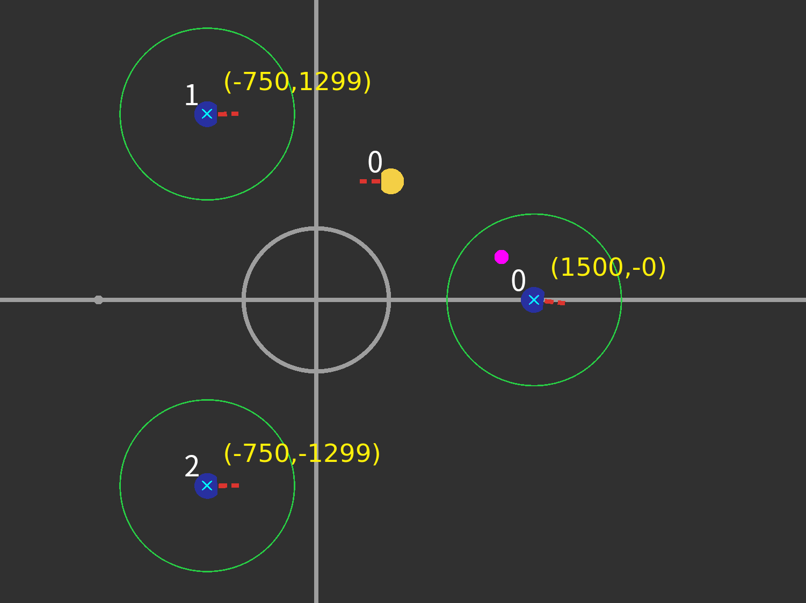
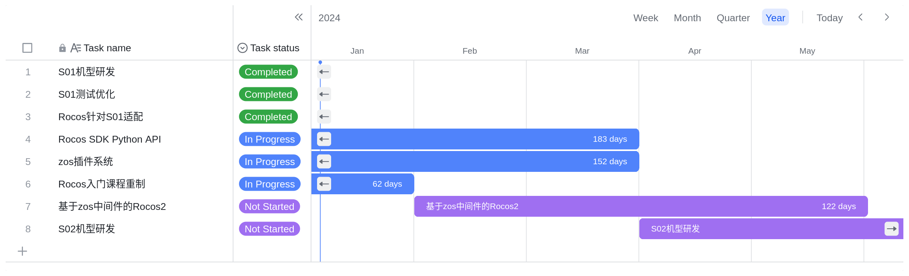

# 

## 2023『途零』🤖⚽竞赛交流会

### 宁波大学科学技术学院

###### Created by [Mark](https://github.com/Mark-ZU)
---
<!-- _class: lead -->
# 机器人🤖足球⚽竞赛交流会

##### 为竞赛参与者提供一个沟通平台和交流社群，促进比赛良好发展
---
# 主要内容

* **上半场**
    * 竞赛经验分享
    * 专题研讨分享
* **下半场**
    * 沟通答疑与反馈
    * 实训演练

---
# 竞赛经验分享
* 2023年比赛反思
* 预测后续的主要进步方向
    * 关于策略：实现**容易维护和传承**的传球策略
    * 单体技能：Skill向通用/鲁棒/泛化的方向实现
    * 硬件改进：针对原有机器人硬件的改进与创新
* 2024年技术挑战赛规则（**草案**）
---

# 技术挑战赛
### 定点传球赛
* 考验Skill的执行效率
* 对于敌方机器人的行为预测
* 考验对于传球决策的计算

---
# 状态跳转函数
* 基于几何信息
    * 距离（点/球/机器人/禁区/球门/边界）/速度/方向
* 基于事件
    * 踢球/红外/出界/球消失
* 基于裁判盒信息
    * Normal Start（开球或点球指令后）
* 保持性函数
    * bufcnt + 上述条件/true

---
# Git & GitHub
* Git是分布式代码版本管理工具
* GitHub是包含了Git Server的托管服务网站
* GitHub其他功能
    * 组织及权限管理
    * 开源社区交流 - PR，ISSUE，WIKI
    * 自动化持续部署测试（CI/CD）
    * Package Server

---
# Python && Lua && C++
| 比较 | Python | Lua | C++ |
| --- |:---:|:---:|:---:|
| 是否需要编译 | 否 | 否 | 是 |
| 运行速度 | 慢 | 中 | 快 |
| 学习难度 | 易 | 易 | 难 |
| OOP | 是 | 部分 | 是 |
| 库支持 | 高 | 低 | 中 |
| 开发效率 | 高 | 中 | 低 |

---
## 机器人性能
* 运动性能
    * 最大速度，最大加速度
* 持球性能
    * 持球状态下 - 移动速度/移动加速度
* 踢球性能
    * 最大挑球距离，最大平射速度
* 通信稳定性
    * 通信带宽/距离/抗干扰能力
---
## 相关开发计划

---
<!-- backgroundImage: -->
<!-- _class: lead invert -->
# Q&A
* Rocos的更新问题