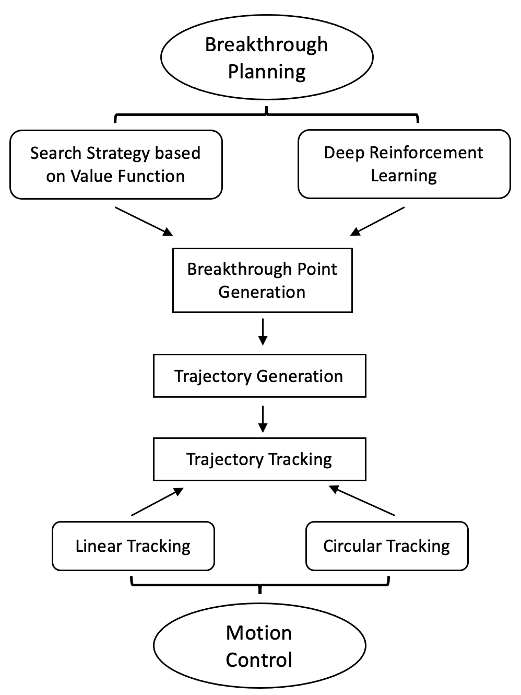
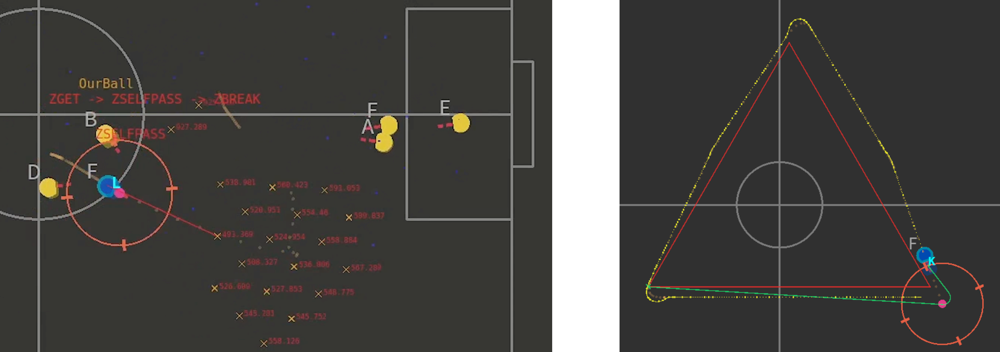

# 

## 2023『途零』🤖⚽竞赛交流会

### 浙江大学城市学院

###### Created by [Mark](https://github.com/Mark-ZU)
---
<!-- _class: lead -->
# 机器人🤖足球⚽竞赛交流会

##### 为竞赛参与者提供一个沟通平台和交流社群，促进比赛良好发展
---
# 主要内容

* **上半场**
    * 竞赛经验分享
    * 专题研讨分享
* **下半场**
    * 沟通答疑与反馈
    * 实训演练

---
# 竞赛经验分享
* 2023年比赛反思
* 预测后续的主要进步方向
    * 关于策略：实现**容易维护和传承**的传球策略
    * 单体技能：Skill向通用/鲁棒/泛化的方向实现
    * 硬件改进：针对原有机器人硬件的改进与创新
* 2024年技术挑战赛规则
---

# 技术挑战赛
### 定点传球赛
* 考验Skill的执行效率
* 对于敌方机器人的行为预测
* 考验对于传球决策的计算

---
###### 策略框架

---
# 球模型

---
# 匹配规则
`{A}(LS)[DM]`
* 依次分组匹配
* 每组进行**匈牙利匹配**
* “{ }” 保持之前的匹配
* “( )” 在状态跳转后进行一次匹配
* “[ ]” 每一帧实时进行匹配

---
# 场地适配
* lua层参数（param.lua）
* c++层参数（staticparam.h）
* client可视化（settings/fields）
    * 场地尺寸
    * 禁区尺寸
    * 球门尺寸

---
# [单机器人盘带](https://ssl.robocup.org/wp-content/uploads/2023/02/2023_ETDP_ZJUNlict.pdf)

* 策略计算
    * 基于规则的盘球点计算

* 路径规划
    * Dubins Path生成

* 运动规划
    * 直线追踪/弧形追踪

---
# 单机器人盘带

---
# 机器人标定 - kickpower?
* 总则 ： 相同的参数/指令 → 相同的效果
    * 运动补偿
    * 踢球标定
    * *电机的PID*
* 踢球精度
    * KickRegulation
    * TouchRegulation

---
<!-- backgroundImage: -->
<!-- _class: lead invert -->
# Q&A
* 进攻如何保证优势的时候避免犯规
* 关于新生的培养方案