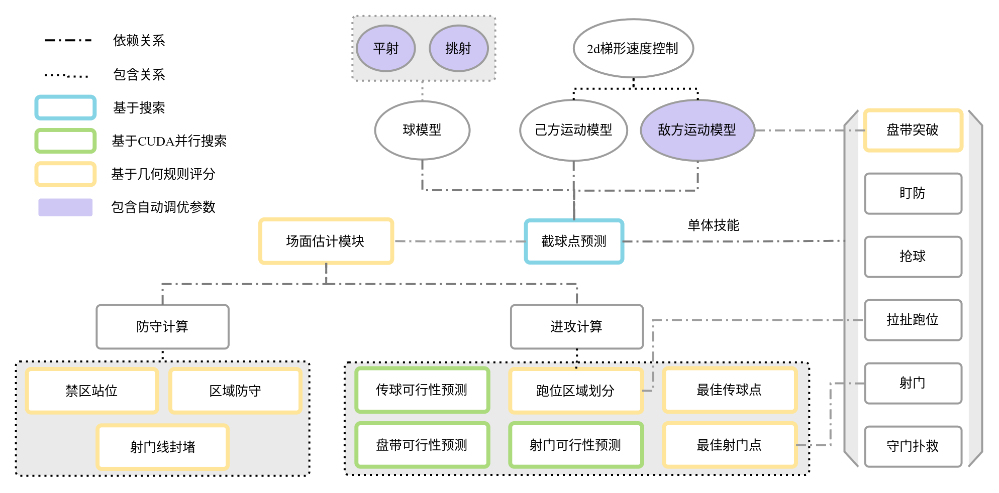
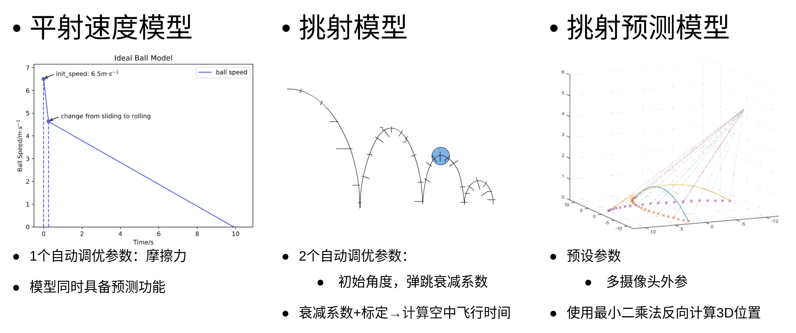

# 

## 2023『途零』🤖⚽竞赛交流会

### 湖州师范学院

###### Created by [Mark](https://github.com/Mark-ZU)
---
<!-- _class: lead -->
# 机器人🤖足球⚽竞赛交流会

##### 为竞赛参与者提供一个沟通平台和交流社群，促进比赛良好发展
---
# 主要内容

* **上半场**
    * 竞赛经验分享
    * 专题研讨分享
* **下半场**
    * 沟通答疑与反馈
    * 实训演练

---
# 竞赛经验分享
* 2023年比赛反思
* 预测后续的主要进步方向
    * 关于策略：实现**容易维护和传承**的传球策略
    * 单体技能：Skill向通用/鲁棒/泛化的方向实现
    * 硬件改进：针对原有机器人硬件的改进与创新
* 2024年技术挑战赛规则
---

# 技术挑战赛
### 定点传球赛
* 考验Skill的执行效率
* 对于敌方机器人的行为预测
* 考验对于传球决策的计算

---
# 决策状态机

* 稳定的Skill - 传球，接球（Intercept/Chase/Touch/Rush）
* 决策模块 - <Receiver,Pos,KickMode,Power>
* 执行稳定 - 传球精度，运动精度

---
###### 策略框架

---
# 球模型

---
# 角色匹配规则
`{A}(LS)[DM]`
* 依次分组匹配
* 每组进行**匈牙利匹配**
* “{ }” 保持之前的匹配
* “( )” 在状态跳转后进行一次匹配
* “[ ]” 每一帧实时进行匹配

---
# 关于代码优化的建议 & 小技巧
* 代码可读性 → 最小化理解所需时间 → 符合直觉(利用TDD定义API)
* 代码模块化 / 解耦
* 提高代码的通用性（不要假设，定义常量代替直接数值）
* 尽量提高代码的马尔可夫性（尽可能减少中间变量个数）
* 根据队伍的人力制定框架和开发计划
* 提高代码的泛化性（在**复制粘贴**代码时提高警惕）
---
<!-- backgroundImage: -->
<!-- _class: lead invert -->
# Q&A
* 如何调节机器人旋转速度？底层调节机器人速度？（标定？）
* 如何处理球丢失的问题？虚拟位置？
* 一个强力的进攻机器人需要哪些Skill？（**GetBall**!!）
* 旋转抢球的Skill & 成功率较高的转身射门的Skill
* 现有代码的优化（架构师？）
* 新生培训&传承
* 获取机器人电量
