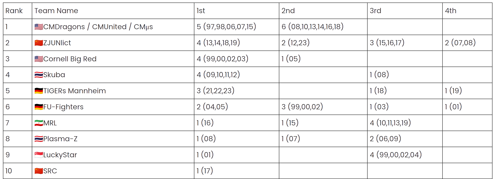

# 
# 深圳技术大学 & 途零机器人

 

#### RoboCup小型组 - 技术分享01
---
# 主要内容
 

* 介绍RoboCup以及小型组
* 了解发展历史
* 了解赛项基本组成
* 认识机器人
* 熟悉Rocos及其架构
---
#### RoboCup及小型组
* 1993 - 学者们提出机器人足球概念
* 1996 - RoboCup预赛在日本名古屋举行
    * 小型组成为RoboCup四大初始赛项
* 2002 - CMU开源策略代码，加速比赛发展
* 2009 - 首次使用ssl-vision统一视觉软件
* 2012 - 小型组首次实现6vs6比赛
* 2015 - 场地扩大至 9m x 6m
* 2018 - 场地扩大至 12m x 9m
* 2020 - 实现 11 vs 11
---
 
 
 

> RoboCup终极目标：到21世纪中叶，一队完全自主的仿人机器人足球运动员将按照国际足联的官方规则，在足球比赛中战胜最近一届世界杯的冠军。
---
### Hall of Fame

---
### 资料
* [TZ-S01](https://rvwy34k2yev.feishu.cn/wiki/X9ASwKfa9ilr8CkqzhcceyCynyc)
* [比赛规则-中文翻译](https://github.com/Robocup-ssl-China/chinaopen_ssl_rules)
* [2022年浙江省赛规则解读](https://github.com/Robocup-ssl-China/zjrobocon-ssl-rules/releases/download/v2022/v2022.pdf)
* [SSL tdps](https://ssl.robocup.org/team-description-papers/)
* [Rocos wiki](https://rocos.readthedocs.io/zh-cn/latest/posts/0_introduction/0_0.html)

---
## Rocos - SSL开源框架
